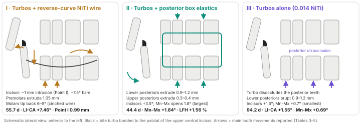
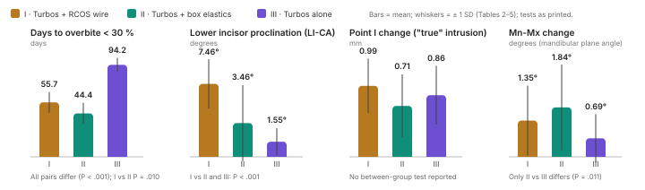

# Assessment of three different techniques in correcting deep overbite: a prospective clinical study

Khaleel R, Al-Nimri K. Angle Orthod 2026;96(5):528–535. DOI 10.2319/100925-850.1.

Design: prospective, non-randomised, single operator, JUST postgraduate clinic, Irbid | 81 enrolled, 80 completed, 27 per arm (Table 1) | Endpoint: days to overbite <30% with posterior Shimstock contact.

## Bottom line

A lower NiTi reverse-curve wire or posterior box elastics added to anterior bite turbos cut the time to a 30% overbite by roughly 40–50% (55.72 and 44.42 versus 94.15 d, Table 2), with similar, untested overbite reduction in every arm (Results). The reverse curve proclined the lower incisors 7.46° and tipped the molars distally 6–9° (Table 3); elastics opened the mandibular plane most (Mn-Mx +1.84°, Table 5). Allocation was by operator judgment, so the 11.3-day elastics-versus-reverse-curve difference is less secure than the 39–50-day gain over turbos alone.

## What was done

- Three arms assigned by the operator on lower incisor alignment, inclination and cooperation (Methods); no registration number.
- Mean ages 15.82/16.00/17.35 y (Table 1). Inclusion: overbite >40%, ANB 1–5°, average or reduced lower face height, average smile line, crowding ≤3 mm; overjet >6 mm excluded (Methods).
- All arms: 0.022 slot, upper 6–6, lower 7–7, turbos on both upper centrals from bonding, upper 0.014 NiTi. I: lower 0.016×0.022 NiTi reverse curve from bonding, cinched distal to the second molars. II: 0.014 NiTi both arches plus bilateral 3/16-inch medium box elastics. III: 0.014 NiTi both arches (Methods).
- Endpoint checked every 14 days chairside; blinding of measurement and analysis only. Cephalograms at bonding and after levelling (corpus-axis and palatal-vault superimposition); Point I, 0.66 of incisor length from the tip, marks true intrusion; intra-examiner ICC 0.92–0.98 (Methods).

## What was found

Tables 3–4 print no P values; the dental P values below are from the Results; Point I and overbite reduction were untested.

| Outcome | Turbos + RCOS (I) | Turbos + elastics (II) | Turbos alone (III) | Between groups |
|---|---|---|---|---|
| Days to correction (Table 2) | 55.72 ± 10.52 (text 55.7 ± 20.5) | 44.42 ± 10.88 | 94.15 ± 7.08 (text 94.4 ± 7.1) | all pairs P ≤ .010 |
| Overbite reduction, mm (Results) | 3.92 ± 0.90 | 3.65 ± 0.92 | 3.57 ± 0.94 | not tested |
| LI-CA change, ° (Table 3) | 7.46 ± 2.52 | 3.46 ± 3.89 | 1.55 ± 1.39 | I > II, III; P < .001 |
| Lower incisor tip V / H, mm (Table 4) | −2.46 / 1.01 | −1.02 / 0.61 | −1.25 / 0.80 | V P < .001; H I vs II P = .027 |
| Point I V, mm (Table 4) | 0.99 ± 0.38 | 0.71 ± 0.44 | 0.86 ± 0.41 | not tested |
| L6-CA / L7-CA, ° (Table 3) | 5.99 / 8.94 (distal) | 0.21 / 0.67 | 0.88 / 0.71 | I > II, III; P < .001 |
| Lower posterior vertical change, mm (Table 4) | −0.64 to 1.06 | 0.90 to 1.19 (text 0.6–1.5) | 0.86 to 1.30 | less in I at the molars (text; no P) |
| Upper posterior vertical change, mm (Table 4) | 0.07 to 0.15 | 0.28 to 0.42 | 0.07 to 0.08 | II > I, III (text; no P) |
| Mn-Mx change, ° (Table 5) | 1.35 ± 1.30 | 1.84 ± 1.59 | 0.69 ± 0.90 | II vs III P = .011 |
| FH-Mn change, ° (Table 5) | 0.97 ± 0.83 | 1.31 ± 1.85 | 0.32 ± 0.49 | II vs III P = .026 |
| LFH change, % (Table 5) | 0.97 ± 0.82 | 1.56 ± 0.84 | 0.41 ± 0.43 | none (P ≥ .489) |

## Strengths

- A new three-way question; neither auxiliary had been tested with turbos before.
- One operator; standardised brackets, turbos, wires and elastics; one cephalostat, duplicate measurement, ICC reported.
- Clear endpoint at 14-day reviews; attrition 1 of 81; candid Limitations section.

## Limitations

- Allocation by operator judgment. Table 1 P values are all ≥ .062, but Group III was oldest (17.35 y) and most crowded (1.81 mm) and Group I had the deepest bite (5.51 mm); these imbalances lie in the direction of the reported differences, without adjustment.
- The endpoint was called at 14-day chairside reviews without blinding, so durations resolve to about one visit interval, larger than the 11.3-day I-vs-II difference.
- No untreated control; mean ages 15.8–17.4 y, while the Discussion describes the sample as nongrowing (p 533); growth and treatment cannot be separated in the vertical outcomes.
- No follow-up beyond the end of levelling (6–14 weeks); no declared primary outcome; no multiplicity control beyond Tukey.

## Points for discussion

- Point I moved 0.99/0.71/0.86 mm in I/II/III (Table 4), untested between groups; the Conclusions attribute about 1 mm of true intrusion to the reverse curve.
- Cooperation was an allocation criterion for the arm that depends on elastic wear (Methods), the arm with the 11.3-day advantage (95% CI 2.32–20.29, Table 2).
- A rectangular reverse curve was the first lower wire, cinched, in arches with ≤3 mm crowding (Methods), so the Table 3 values apply to aligned arches.
- The endpoint is a 30% overbite with turbos in place, not a levelled arch; curve of Spee depth, turbo removal and finishing are not reported.

## Clinical implications

- The choice between elastics and a reverse curve rests on incisor inclination, compliance and vertical pattern rather than on 11 days.
- Not applicable to increased lower face height, high smile line, overjet >6 mm, crowding >3 mm or the nongrowing adult.

| Patient | Reasonable choice from this study | Expected trade-off |
|---|---|---|
| Short or average face, compliant, lower incisors already forward | Turbos + box elastics (44.42 d, Table 2) | Mn-Mx +1.84°, LFH +1.56% (Table 5); LI-CA +3.46° (Table 3); upper posterior extrusion 0.28–0.42 mm (Table 4) |
| Upright, well-aligned lower incisors; compliance uncertain | Turbos + 0.016×0.022 NiTi reverse curve (55.72 d, Table 2) | LI-CA +7.46°, L7 distal tipping 8.94° (Table 3); tip 1.01 mm forward (Table 4) |
| Lower incisors already proclined, time not critical | Turbos + 0.014 NiTi alone (94.15 d, Table 2) | LI-CA +1.55° (Table 3); Mn-Mx +0.69° (Table 5); lower posterior eruption 0.86–1.30 mm (Table 4) |
| Increased lower face height, high smile line or nongrowing adult | Not covered; these patients were excluded or not represented | Every arm opened the mandibular plane (0.69–1.84°, Table 5); intrusion mechanics are the textbook alternative |

## How it sits with previous evidence

- Al-Zoubi & Al-Nimri 2022 (Angle Orthod, same unit, RCT): turbos with a plain lower 0.016×0.022 NiTi 3.15 months (≈96 d), reverse curve alone 4.85 months; Point I 1.01/0.28 mm (reverse curve/turbos). The turbos-alone duration here is of the same order; the turbos-alone Point I (0.86 mm) is about three times the 2022 value.
- Weiland 1996 (AJODO): continuous arches extruded molars 1.30 mm and opened ML/NSL 1.94°; segmented arches intruded incisors 1.72 mm without posterior extrusion; all three arms here follow the continuous-arch pattern.
- Proffit (Contemporary Orthodontics, Ch 15, 17, 20): a continuous lower reverse curve levels mainly by extrusion; a rectangular one commonly adds unwanted labial crown torque; slight posterior elongation is acceptable in a short or average face while growth remains.
- Stability: low-angle patients relapsed through incisor inclination (Rozzi 2019, Eur J Orthod); 10-y relapse 1.2 mm low-angle versus 0.1 mm high-angle (Pollard 2012, AJODO); overbite 5.3 → 2.6 → 3.4 mm long-term (Huang 2012); this sample is that phenotype, without follow-up.

## Reporting notes

- Duration: Group I SD 10.52 d (Table 2) versus 20.5 d (Results); Group III mean 94.15 d (Table 2), 94.4 d (Results), 94.2 d (abstract).
- Group II lower posterior extrusion 0.6–1.5 mm (Results) versus 0.90–1.19 mm (Table 4); upper incisor 1.5° for Group II (Results) versus −0.34° in Table 3 (1.47° is Group III).
